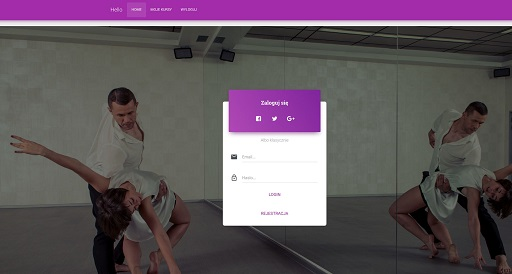
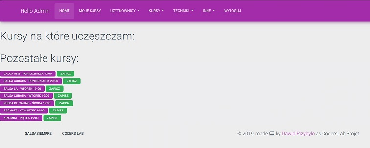
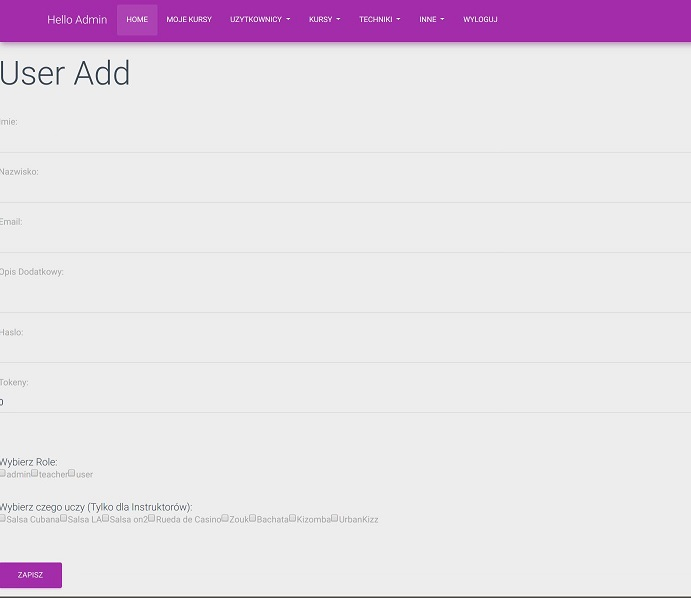
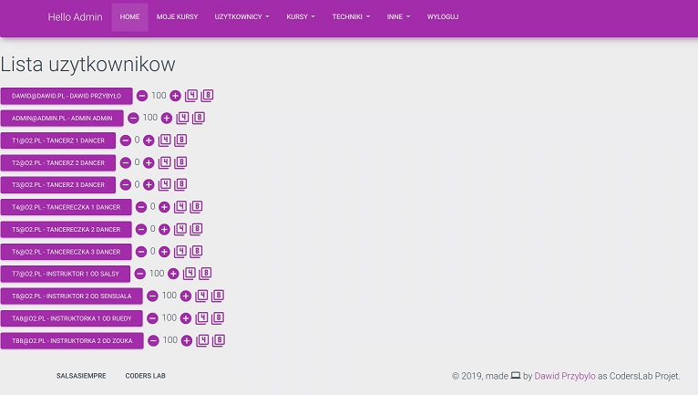
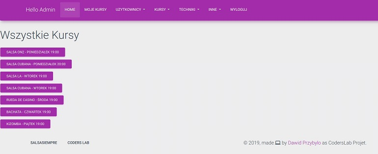
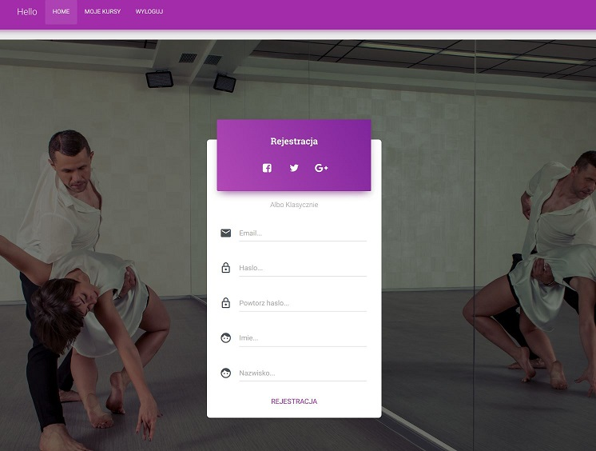
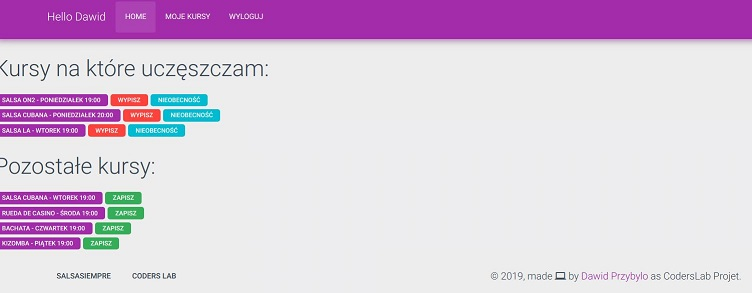

# Warsztat7_SzkolaTanca
Polish Below / Polski poniżej
--------
Graduation project for CodersLab
Functions: Managing DanceSchool: users, user credit, membership carts, instructors, techniques and classes.

TECHNOLOGIES USED: Java, JSP, mySQL, Spring, Hibertnate

--------
Projekt zaliczeniowy Szkoła tańca na zakończenie kursu CodersLab
Funkcje: zarządzanie bazą użytkowników szkoły tańca, saldem użytkowników, karnetami, instruktorami technikami oraz zajęciami

Użyte technologie: Java, JSP, mySQL, Spring, Hibernate

